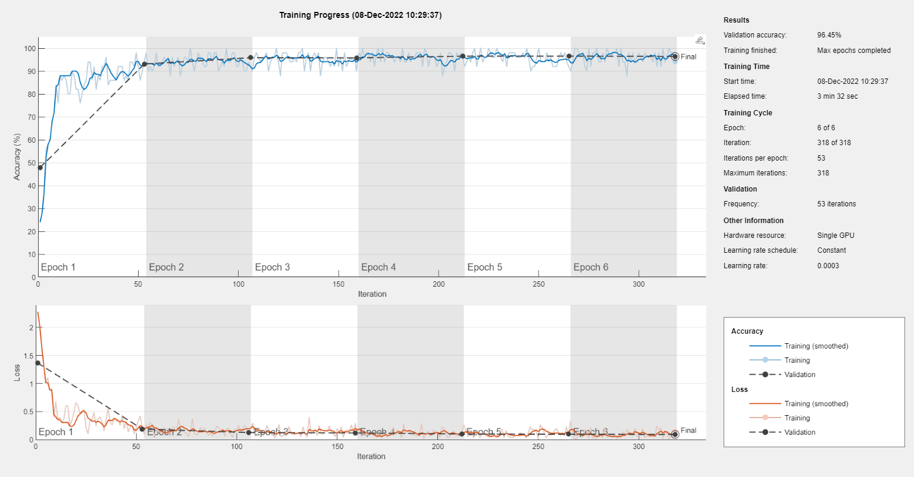
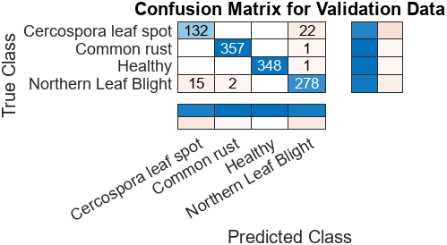

# LAKAPATI - Corn Disease Classifier with Mitigation System using Neural Network
Author: Erwin Bonto and Samantha Louise Aldaba
## Introduction
LAKAPATI aims to help farmers and researchers to mitigate the loss of crops with the use of Computer Vision and Deep Learning algorithms. Convolutional neural network (CNN) is used in the application to classify the condition of the crops. Along with class activation mapping, this enables localizing and generating the heatmap of the affected areas. The layers of the networks will be trained along with the PlantVillage dataset (Hughes, et al., 2015) as a basis for identifying the disease of the corn crops. The application contains four functionalities that will be useful to the users. The functionality of the application contains an image uploader, a Disease wiki, Displaying heatmap and processed image, and a Disease classifier. The image uploader enables the user to upload the image of the corn crops. The disease wiki contains a database of information regarding the condition of the corn crops and the approach to deal with it. The disease classifier determines the condition or the disease of the crops with the help of CNN.

GoogLeNet architecture is used as a backbone for the network that will be used for identifying the conditions of the corn crops. The model achieved an accuracy of 96.45% during the model training backed with the GPU-powered computer for faster training. Shown below are the set of pictures containg the graph of accuracy per epoch during the training phase and the Confusion Matrix which has been used as the metrics for identifying the performance of the model.

## Submission Procedure
- In this repository, please upload a `report.pdf` that shows the step-by-step procedure in order to present the functionalities you've written in the Functionalities Section. (Note: Please add step-by-step screenshots).
- I've given you [report.docx](report.docx) so that you have a template. Please download and edit it.

- You can optionally add a video walkthrough so that you could improve the clarity of your submission. To do so,
you can upload it in Google Drive / YouTube, then add the link in this README. You can do it by editing this link here: [project link](https://youtu.be/VQKMoT-6XSg)
     - If it's Google Drive, Make sure I have a view access (i.e. De La Salle University, Anyone with the link can view)
     - If it's Youtube, Make sure to keep it unlisted. You can opt to make it public after grade consultation day

- Alternatively, if you're adventurous, you can edit this README and add the procedures here.
- In order to add photo, just put the folder in assets folder, and edit this README to checkout what I did below:

- for more tricks and tips, just google markdown cheatsheet. 

